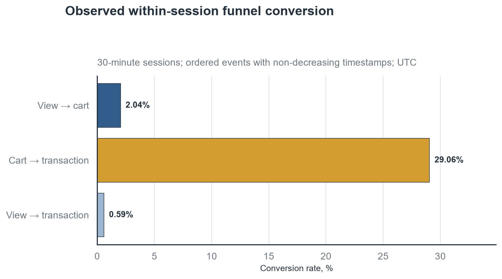
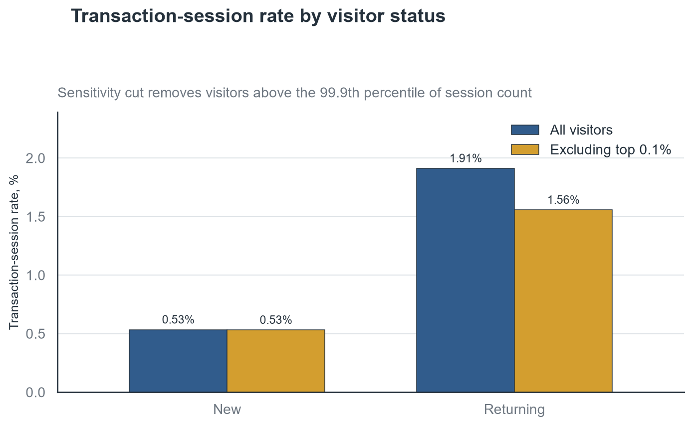
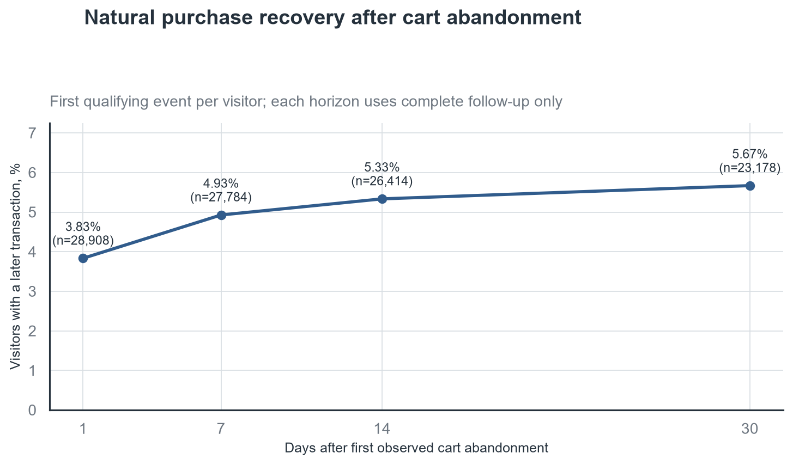
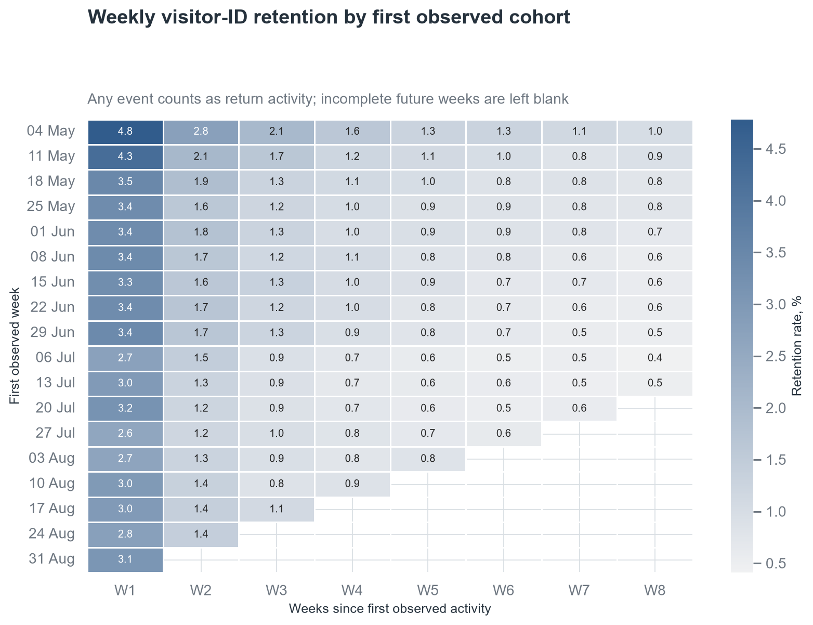

# E-commerce Journey Analytics

Product analysis of 2.76 million real e-commerce events: session funnel,
retention, behavioral segments, and the design of a cart-recovery experiment.

The project answers one decision question:

> Which next experiment is most defensible if the product team wants to
> increase purchase conversion with the event data currently available?

## Decision summary

The best-supported next step is a cart-recovery experiment for recognized,
contactable visitors. It is a testable recommendation, not a causal conclusion
from observational data.

- The fixed source contains 2,756,101 events from 1,407,580 anonymized visitor
  IDs. After removing 460 exact duplicate rows, a 30-minute inactivity rule
  produces 1,761,675 sessions.
- Only 0.81% of sessions contain a transaction. Returning sessions convert at
  1.91% versus 0.53% for first sessions, a 3.58x descriptive difference. After
  excluding visitors above the 99.9th percentile of session count, the rates
  are 1.56% and 0.53%, so the pattern is not explained only by the heaviest
  visitors.
- There are 31,992 sessions with a cart event and no transaction in the same
  session. Among first observed cart-abandonment cases with a complete
  seven-day follow-up, 1,369 of 27,784 visitors purchase later: a natural
  recovery rate of 4.93%.
- With about 1,483 newly eligible visitors per complete week, detecting a 25%
  relative lift over the 4.93% baseline requires approximately 5,416 visitors
  per arm and nine calendar weeks, including the outcome window.

The data do not contain checkout steps, acquisition source, device, revenue,
stock status, or experiment assignment. Therefore they support prioritizing a
test and improving instrumentation, but not claiming why a visitor abandoned a
cart or how much revenue an intervention would create.

## Main evidence

The largest observed loss is before an add-to-cart event, while 29.06% of
ordered view-to-cart sessions continue to a transaction in the same session.
This identifies the stage, but not the underlying friction.



Returning visitor IDs are substantially more likely to transact. The
sensitivity cut shows that a small group of unusually active visitors
strengthens, but does not create, this pattern.



Cart abandoners form a smaller but high-intent audience with a measurable
post-session baseline. This makes a recovery intervention more specific and
testable than a broad redesign based on the current schema.



Weekly retention is low and declines quickly. Because `visitor_id` is an
anonymous identifier, this is visitor-ID return activity rather than verified
person-level retention.



## Product and metric framework

The product is an anonymized multi-category e-commerce site. A visitor can
generate `view`, `addtocart`, and `transaction` events.

| Role | Metric | Definition |
|---|---|---|
| Outcome | Transaction-session rate | Sessions with at least one transaction / all sessions |
| Funnel driver | Ordered view-to-cart rate | View sessions with a later cart event / view sessions |
| Funnel driver | Ordered cart-to-transaction rate | Ordered view-to-cart sessions with a later transaction / ordered view-to-cart sessions |
| Retention | Weekly visitor-ID retention | Cohort visitors with any event in week W1-W8 / cohort size |
| Experiment outcome | Seven-day purchase conversion | Eligible assigned visitors with a transaction within seven days / all eligible assigned visitors |

For an actual cart-recovery test, product-quality guardrails should include
notification opt-outs or complaints, refunds or cancellations, gross margin,
and delivery failures. These fields are not present in the public dataset and
must be instrumented before the test.

## Data and quality controls

The project uses version 4 of the
[Retailrocket recommender system dataset](https://www.kaggle.com/datasets/retailrocket/ecommerce-dataset).
It contains anonymized behavior from 3 May to 18 September 2015.

Key controls:

- fixed source and `events.csv` SHA-256 checks;
- exact-row deduplication before metrics;
- required-field, event-domain, and transaction-ID consistency checks;
- UTC conversion of Unix timestamps;
- 15/30/60-minute session-gap sensitivity;
- exclusion of partial boundary weeks;
- right-censoring for retention and cart-recovery horizons;
- a concentration cut for visitors above the 99.9th percentile of session
  count.

The transaction rows are item-level: 22,457 transaction item events correspond
to 17,672 distinct transaction IDs. Session conversion therefore uses the
presence of a transaction rather than summing transaction rows.

## Experiment proposal

The proposed treatment is a saved-cart reminder sent after the first qualifying
cart-abandonment session. Eligibility and randomization must be defined before
delivery:

- unit of randomization: stable visitor or account ID;
- inclusion: first cart session with no transaction, after a fixed inactivity
  delay;
- population: recognized visitors with a permitted delivery channel;
- primary metric: seven-day visitor conversion, analyzed by intention to treat;
- design: 50/50 assignment, two-sided alpha 0.05, power 0.80;
- planning MDE: 25% relative, from 4.93% to 6.16%;
- required sample: 5,416 visitors per arm;
- estimated duration: nine calendar weeks including follow-up.

The full design, guardrails, instrumentation, and decision rule are documented
in [docs/experiment_design.md](docs/experiment_design.md).

## Repository structure

```text
ecommerce-journey-analytics/
├── data/                       Raw and generated data are ignored
├── docs/
│   └── experiment_design.md
├── notebooks/
│   └── 01_ecommerce_journey_analysis.ipynb
├── outputs/
│   ├── figures/                Committed analytical figures
│   ├── tables/                 Committed reviewed result tables
│   ├── summary_metrics.json
│   └── validation_report.txt
├── scripts/
│   ├── download_data.py
│   ├── run_pipeline.py
│   └── validate_project.py
├── sql/                        Executed DuckDB SQL transformations
└── src/ecommerce_journey/      Python pipeline, plots, power, validation
```

## Reproduce on Windows PowerShell

```powershell
git clone https://github.com/No-NameMan/ecommerce-journey-analytics.git
cd ecommerce-journey-analytics

python -m venv .venv
.\.venv\Scripts\Activate.ps1
python -m pip install --upgrade pip
pip install -r requirements.txt

python scripts\download_data.py
python scripts\run_pipeline.py
```

The first command downloads a 291 MiB archive, verifies it, and extracts only
the 90 MiB event file. The second command builds the DuckDB model, executes all
SQL, exports tables, renders figures, runs the notebook top to bottom, and
checks the headline results.

To rerun validation separately:

```powershell
python scripts\validate_project.py
```

Open the executed notebook:

```powershell
jupyter lab notebooks\01_ecommerce_journey_analysis.ipynb
```

## Limits and next data to collect

The analysis is observational. Behavioral segments are selected by behavior
and should not be read as treatment effects. `visitor_id` may represent a
browser or cookie rather than a person, and cross-device activity is not
resolved.

The next instrumentation priority is:

- `checkout_started`, `payment_method_selected`, `payment_failed`, and
  `order_completed`;
- experiment assignment, reminder delivery, click, and suppression reason;
- stable account identity and communication consent;
- acquisition channel, device, locale, and app/web platform;
- price, quantity, discount, margin, inventory, cancellation, and refund.

These events would allow the team to separate discovery friction, checkout
failure, cart persistence, and message delivery instead of treating every
missing transaction as the same problem.

## License

Code is licensed under MIT. The source dataset and generated analytical outputs
are subject to CC BY-NC-SA 4.0; see [DATA_LICENSE.md](DATA_LICENSE.md).
